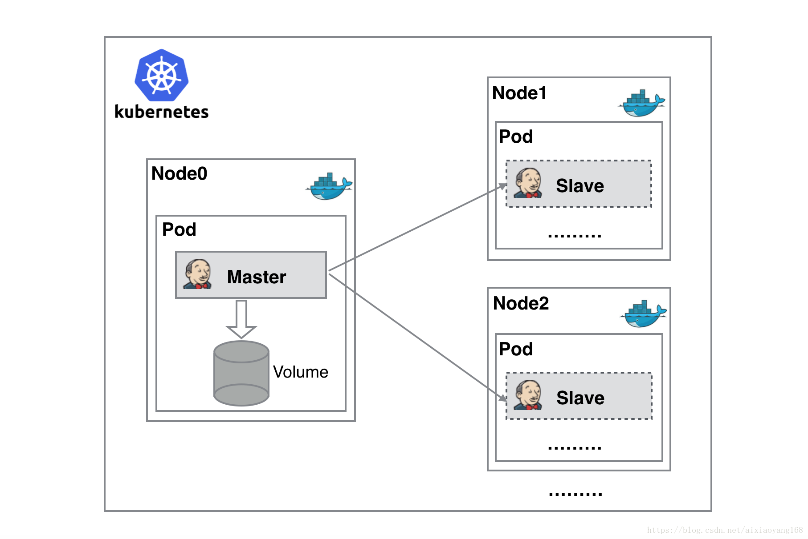

# Jenkins on k8s
## 架构图

这种方式的工作流程大致为：当 Jenkins Master 接受到 Build 请求时，会根据配置的 Label 动态创建一个运行在 Docker Container 中的 Jenkins Slave 并注册到 Master 上，当运行完 Job 后，这个 Slave 会被注销并且 Docker Container 也会自动删除，恢复到最初状态

## 为什么这样架构
* 服务高可用，当 Jenkins Master 出现故障时，Kubernetes 会自动创建一个新的 Jenkins Master 容器，并且将 Volume 分配给新创建的容器，保证数据不丢失，从而达到集群服务高可用。
* 动态伸缩，合理使用资源，每次运行 Job 时，会自动创建一个 Jenkins Slave，Job 完成后，Slave 自动注销并删除容器，资源自动释放，而且 Kubernetes 会根据每个资源的使用情况，动态分配 Slave 到空闲的节点上创建，降低出现因某节点资源利用率高，还排队等待在该节点的情况。
* 扩展性好，当 Kubernetes 集群的资源严重不足而导致 Job 排队等待时，可以很容易的添加一个 Kubernetes Node 到集群中，从而实现扩展。

[参考链接](https://blog.csdn.net/aixiaoyang168/article/details/79767649)