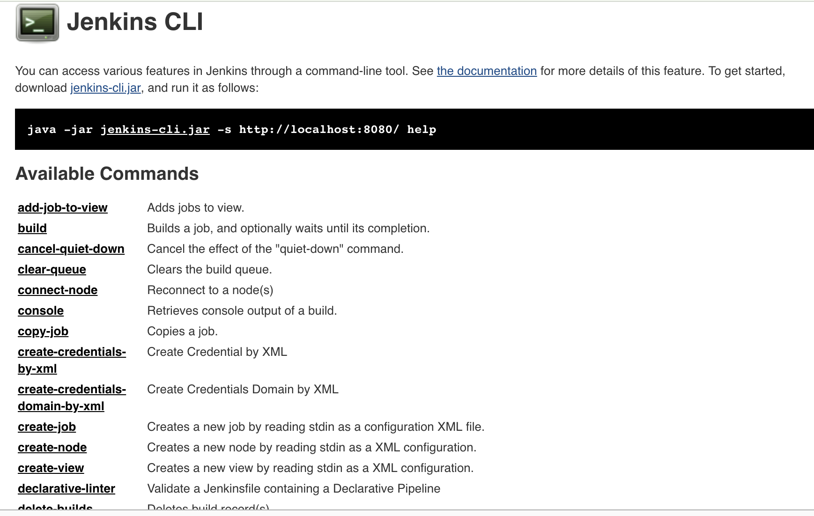

# Jenkins

* Mac 上 jenkins 运行的问题
* Jenkins cli 
* golang sdk 调用 jenkins api 创建 pipeline Job

## 由 Jenkinsfile 引发的问题

```
pipeline {
    agent {
        docker {
            image 'maven:3-alpine'
        }
    }
    stages {
        stage('Build') {
            steps {
                sh 'mvn -B -DskipTests clean package'
            }
        }
    }
}
```

### 添加额外的环境变量
> 您可以在Jenkins-> Configure System中执行此操作。
* 定义一个名为PATH+EXTRAEXTRA显然可以是任何东西的变量。
* 在该变量中，只需添加PATH的附加内容即可。所以在我上面的例子中，我根本不会设置PATH，而是我只是设置： PATH+EXTRA=/opt/blah/bin

### Blue Ocean 插件安装
> 好看的流程界面,插件管理处搜索安装即可。


### 关于 docker 的相关配置
Mac OSX 系统 上面提到配置 docker 环境变量,只是可以 agent 阶段运行拉取镜像，后面的 stages 阶段就要报 docker 找不到了。

找到了三种方式

1. ln -sf /usr/local/bin/docker /usr/bin/docker （ln: /usr/bin/docker: Operation not permitted Mac OSX 新版系统 不能变动 /usr/bin /bin）
2. vim /usr/local/opt/jenkins/homebrew.mxcl.jenkins.plist 
添加一段

```
    <key>EnvironmentVariables</key>
    <dict>
      <key>PATH</key>
      <string>/usr/local/bin:/usr/bin:/bin:/usr/sbin:/sbin</string>
    </dict>
```

* 2.1 完整的 `/usr/local/opt/jenkins/homebrew.mxcl.jenkins.plist` 配置如下

```
<?xml version="1.0" encoding="UTF-8"?>
<!DOCTYPE plist PUBLIC "-//Apple//DTD PLIST 1.0//EN" "http://www.apple.com/DTDs/PropertyList-1.0.dtd">
<plist version="1.0">
  <dict>
    <key>Label</key>
    <string>homebrew.mxcl.jenkins</string>
    <key>ProgramArguments</key>
    <array>
      <string>/usr/libexec/java_home</string>
      <string>-v</string>
      <string>1.8</string>
      <string>--exec</string>
      <string>java</string>
      <string>-Dmail.smtp.starttls.enable=true</string>
      <string>-jar</string>
      <string>/usr/local/opt/jenkins/libexec/jenkins.war</string>
      <string>--httpListenAddress=127.0.0.1</string>
      <string>--httpPort=8080</string>
    </array>
    <key>EnvironmentVariables</key>
    <dict>
      <key>PATH</key>
      <string>/usr/local/bin:/usr/bin:/bin:/usr/sbin:/sbin</string>
    </dict>
    <key>RunAtLoad</key>
    <true/>
  </dict>
</plist>
```

## Jenkins Cli
Jenkins Cli 提供了诸多命令可以与 Jenkins 交互
如导出 Job `java -jar jenkins-cli.jar -s http://localhost:8080/ -auth admin:admin get-job      my-k8s-jenkins-pipeline >    my-k8s-jenkins-pipeline.xml`


## Golang SDK 调用 Jenkins api 创建 Pipeline Job
代码如下

```golang
package main

import (
	"fmt"

	"github.com/bndr/gojenkins"
)

func main() {
	// client := &http.Client{}
	jenkins := gojenkins.CreateJenkins(nil, "http://localhost:8080", "admin", "admin")
	jenkins.Init()

	configString := `<?xml version='1.1' encoding='UTF-8'?>
	<flow-definition plugin="workflow-job@2.34">
	  <actions/>
	  <description>app.env 描述</description>
	  <keepDependencies>false</keepDependencies>
	  <properties/>
	  <definition class="org.jenkinsci.plugins.workflow.cps.CpsFlowDefinition" plugin="workflow-cps@2.74">
		<script>def label = &quot;mypod-${UUID.randomUUID().toString()}&quot;
	podTemplate(label: label, cloud: &apos;kubernetes&apos;) {
		node(label) {
			stage(&apos;Run shell&apos;) {
				sh &apos;sleep 130s&apos;
				sh &apos;echo hello world.&apos;
			}
		}
	}</script>
		<sandbox>true</sandbox>
	  </definition>
	  <triggers/>
	  <disabled>false</disabled>
	</flow-definition>`
	_, err := jenkins.CreateJob(configString, "api-create-my-k8s-jenkins-pipeline")
	if err != nil {
		fmt.Println(err.Error())
	}

}
```
